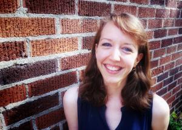

```{r setup, include=FALSE}
knitr::opts_chunk$set(echo = FALSE)
```
{width=50%}


  I received CIC Diversity Funds to support travel to the third annual meeting of the Society for the Improvement of Psychological Science (SIPS) during the Summer of 2018. SIPS does not follow a traditional conference format. Rather, participants elect to attend workshops designed to teach a discrete skill (e.g. power analysis for specific models) and participate in hackathons (designed to generate deliverables related to a problem or dilemma in psychological research). Conference days typically run 8am-4pm with participants able to move fluidly between workshops and hackathons on various topics as they see fit. CIC Funds supported my participation in the working group and hackathon on Diversity and Inclusivity throughout the three conference days. 
  
  To check out more about SIPS, see their website here: https://improvingpsych.org/
  
  On the first day, the working group identified a primary problem – despite in-group perception otherwise, the “open science” community appears exclusionary and unwelcoming. That is, although members holding marginalized identities within the open science community did not perceive the community as exclusionary, there is a prevalent perception that this community is hostile or indifferent to the experiences and perspectives of those who hold marginalized identities. This perception, in turn, contributes to a community dominated by majority group members and diminishes inclusion of valuable, diverse voices. In order to work to address these concerns, three efforts were undertaken:
  
  1) generation of items to assess the prevalence of experiences of hostility, aggression, exclusion, inclusion, comfort, and participation in the open science community; 
  
  2) creation of a serialize podcast to elevate diverse voices as they currently exist within the open science community; and 
  
  3) the generation of mechanisms to increase the inclusivity of the SIPS conference.

  I participated primarily in the latter two initiatives. Specifically, regarding the podcast, I helped design the format of the podcast, brainstorm a list of initial guests, and record the “trailer” episode. To check out this podcast visit:  
  
  Regarding the former, I helped create an initiative called “SIPS Sibs”. As a part of this program, first-time attendees to the SIPS conference may choose to be paired with an experienced SIPS attendee. This more experienced “sib” serves as a guide for the conference newcomer to help navigate the heavily social, informal environment of a SIPS conference. The goal of this program is to create a more welcoming, inclusive environment for that those without institutional knowledge or knowledge that can only be gained via in-group membership. SIPS Sibs is being implemented during the 4th annual SIPS meeting in the summer of 2019.

  As a part of these initiatives, I was able to personally benefit from the exposure to thought leaders in the open science community around issues of diversity and inclusion. I was also able to contribute to concrete initiatives aimed at better understanding and addressing issues of inclusion and diversity within the open science community. In considering the impact of my participation in these events, I am particularly struck by how often I now recognize the role of “insider knowledge” in academia. Specifically, I have become increasingly aware of the ways in which class (family income, parents who are college graduates, community norms) transmits knowledge about and strategies for success in academia. In turn, this knowledge then serves as a barrier to those from under-represented groups who do not have the benefit of this knowledge. In considering how my efforts might benefit the department, it seems evident that we (both collectively and as individuals) might do well to increase our attention to the role of unspoken norms and insider knowledge in our expectations of each other and our students. We might consider adjusting expectations to not favor those who have benefitted from this knowledge or to make more transparent the skills and knowledge necessary for success in meeting these expectations. Efforts to make the community more inclusive might include those that reduce the level of assumed knowledge about how one operates at a large research-intensive university.


