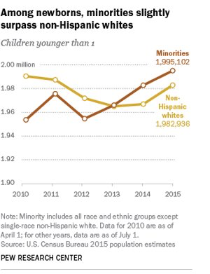
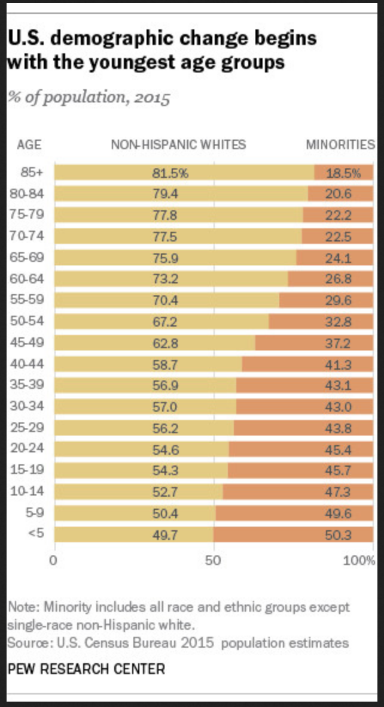
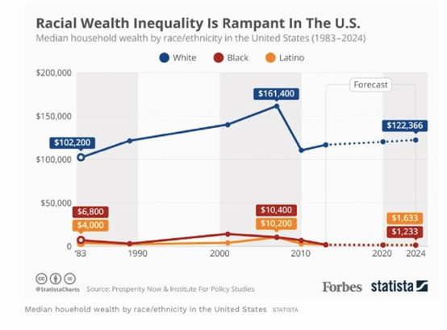

```{r setup, include=FALSE}
knitr::opts_chunk$set(echo = FALSE)
library(here)
```
{width=50%}

I attended “Conceptualizing and measuring culture, context, race and ethnicity: A focus on science, ethics, and collaboration in the Spirit of 2044” held by Society for Research in Child Development (SRCD) in March 2019. One of the goals of the preconference was to discuss how to best conceptualize race and ethnicity (specifically “minority” populations) as the United States continues to diversify.

The following graphs were presented showing that minority populations are increasing, yet racial wealth inequality continues to be evident in the U.S. Gabby Galeano discussed that the U.S. will be a majority-minority country by 2044 and commented on the continued need for research on minority populations. 

{width=50%}{width=50%}


https://www.pewresearch.org/fact-tank/2016/06/23/its-official-minority-babies-are-the-majority-among-the-nations-infants-but-only-just/ft_16-06-23_censusmajorityminority_trend/


https://www.pewresearch.org/fact-tank/2016/06/23/its-official-minority-babies-are-the-majority-among-the-nations-infants-but-only-just/ft_16-06-23_censusmajorityminority_agegroups/



https://www.forbes.com/sites/niallmccarthy/2017/09/14/racial-wealth-inequality-in-the-u-s-is-rampant-infographic/#57454c4534e8


     
One of the breakout sessions that I attended focused on the importance of ethnic-racial identity constructs on diverse populations. Much of the conversation focused on policy and intervention. One intervention discussed was EMBRace which focuses on racial socialization (Anderson, McKenny, & Stevenson, 2018). EMBRace stands for Engaging, Managing, and Bonding through Race (EMBRace) and can has been used to reduce racial stress and trauma for families (both parent and children), within the racial socialization process.  An example of this taken from the EMBRace website is, "If a parent is talking to a child about a recent murder publicized by the media, the parent has to not only engage with the youth but also manage his/her own trauma about the racial incidents he/she has experienced either personally or vicariously." Racial socialization is often utilized in teaching youth about racist experiences, but less emphasis has been given to the need for the parent to protect their internalized pain throughout the process.


Another topic that was evident throughout the conference was the need for culturally component clinicians for research and intervention work. It brings the question to the table, “Who has the authority to have these conversations with families?”.  Many people feel that graduate students, including the ones at our university, aren’t getting enough diversity training in graduate school and this is a significant deficit. Further, this training needs to start at a higher level so graduate students can be appropriately trained. Discussion facilitators emphasized that there should be explicit guidelines stating what type of diversity training is included in your graduate program, and if there’s not, we shouldn’t be afraid to bring them up! 

Below are resources on learning more about some of the topics in this Blog Post:

Immigration - statistical portrait of foreign-born population in the U.S. https://www.pewhispanic.org/2018/09/14/facts-on-u-s-immigrants/

To learn more about EMBRace.
https://www.recastingrace.com/research/embrace


Anderson, R. E., McKenny, M., Mitchell, A., Koku, L., & Stevenson, H. C. (2018). EMBRacing racial stress and trauma: Preliminary feasibility and coping responses of a racial socialization intervention. Journal of Black Psychology, 44(1), 25-46.
http://dx.doi.org/10.1177/0095798417732930

APA Resources on Diversity in Graduate Education:
https://www.apa.org/education/grad/diversity

Graduate Students Perceptions on Diversity Training:
Green, D. , Callands, T. A., Radcliffe, A. M., Luebbe, A. M. and Klonoff, E. A. (2009), Clinical psychology students' perceptions of diversity training: a study of exposure and satisfaction. J. Clin. Psychol., 65: 1056-1070. doi:10.1002/jclp.20605


